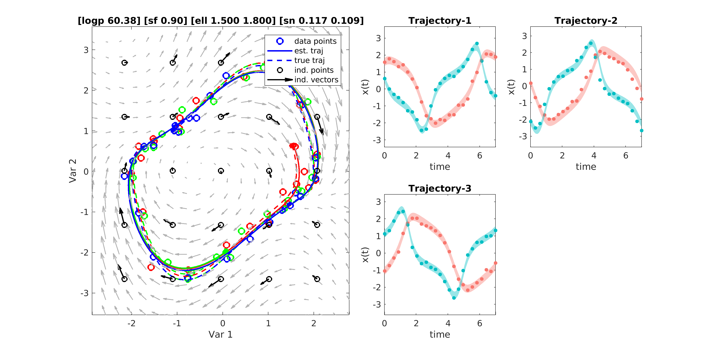

## [This repository is overriden by a more recent TensorFlow implementation available [here](https://github.com/cagatayyildiz/npde/).]

# npODE

This repository contains a MATLAB implementation of npODE - a nonparametric model for learning unknown ordinary differential equations. The paper we describe the model is on [arxiv](https://arxiv.org/abs/1803.04303).

## MATLAB Code
The implementation is in MATLAB (2017b) and it does not depend on any software other than MATLAB's own optimization function ``fminunc`` and ODE solver ``ode45``. So, you should be able to run the code off-the-shelf. 

Fitting our model on some data is as simple as follows:
```matlab
gp = npode_fit(t,Y); % t and Y are the time points and the observations
```

It is also possible to predict the future:
```matlab
X = npode_predict(gp,ts,x0) % ts and x0 are the time points and the initial value
```

To familarize yourself with the implementation, you may see ``demo``. This script first generates trajectories from [Van der Pol oscillator](https://en.wikipedia.org/wiki/Van_der_Pol_oscillator) with Gaussian noise, and then fits and visualizes npODE model. After fitting the model, you should see a figure similar to below: 



Perhaps the next file to investigate is ``ode/np_de_model``, where npODE model parameters are stored. The posterior and its gradients are computed in ``ode/np_ode_fg``.

### CMU Walking Data Experiments
To evaluate the model on real data, we use a benchmark dataset of human motion capture data from the Carnegie Mellon University motion capture ([CMUmocap](http://mocap.cs.cmu.edu/)) database. We evaluate the method with two types of experiments: imputing missing values and forecasting future cycles. 

The folder named ``exps`` is devoted for these experiments. To run the experiments, switch to this directory and execute ``demo_cmu_walking``. See the file for how to input different files and run imputation/forecasting experiments.

It is also possible to execute two more models on the same data sets: [Gaussian Process Dynamical Model (GPDM)](http://www.dgp.toronto.edu/~jmwang/gpdm/) and [Variational (Bayesian) GP-LVM model (VARGPLVM)](https://github.com/SheffieldML/vargplvm). In order to run these models, please download the software from the links above and update the paths in ``exps/init_paths.m``.
