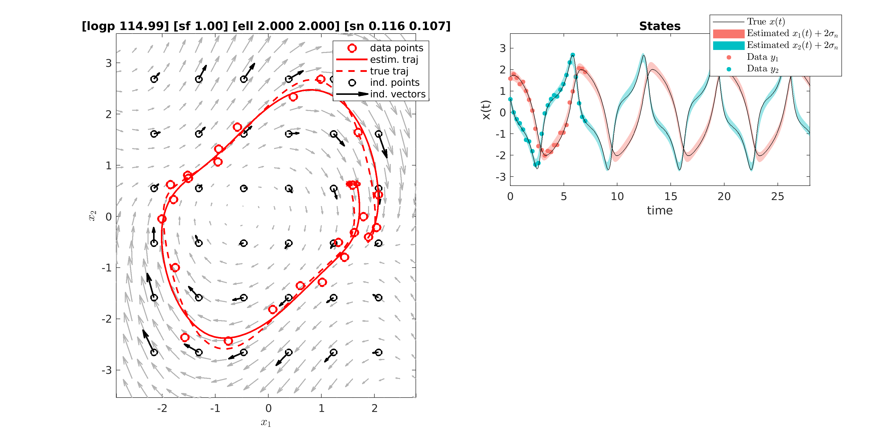

# npODE

This repository contains a MATLAB implementation of npODE - a nonparametric model for learning unknown ordinary differential equations. The paper we describe the model will be available on [arxiv](https://arxiv.org) soon.

## MATLAB Code
The implementation is in MATLAB (2017b) and it does not depend on any software other than MATLAB's own optimization function ``fminunc`` and ODE solver ``ode45``. So, you should be able to run the code off-the-shelf.

A good starting point is ``demo_ode``. This script first generates three trajectories from [Van der Pol oscillator](https://en.wikipedia.org/wiki/Van_der_Pol_oscillator) with different initial values, adds some noise and then fits npODE model. After fitting the model, you should see the below figure: 

The script allows fitting toy data generated from [Lotka–Volterra](https://en.wikipedia.org/wiki/Lotka%E2%80%93Volterra_equations) and [FitzHugh–Nagumo](https://en.wikipedia.org/wiki/FitzHugh%E2%80%93Nagumo_model) models. npODE model parameters are stored in ``ode/np_de_model`` object, you can see this file to familarize yourself with the model. The posterior and its gradients are computed in ``ode/np_ode_fg``.

### CMU Walking Data Experiments
To evaluate the model on real data, we use a benchmark dataset of human motion capture data from the Carnegie Mellon University motion capture ([CMUmocap](http://mocap.cs.cmu.edu/)) database. We evaluate the method with two types of experiments: imputing missing values and forecasting future cycles. 

The folder named ``exps`` is devoted for these experiments. To run the experiments, switch to this directory and execute ``demo_cmu_walking``. See the file for how to input different files and run imputation/forecasting experiments.

It is also possible to execute two more models on the same data sets: [Gaussian Process Dynamical Model (GPDM)](http://www.dgp.toronto.edu/~jmwang/gpdm/) and [Variational (Bayesian) GP-LVM model (VARGPLVM)](https://github.com/SheffieldML/vargplvm). In order to run these models, please download the software from the links above and update the paths in ``exps/init_paths.m``.
